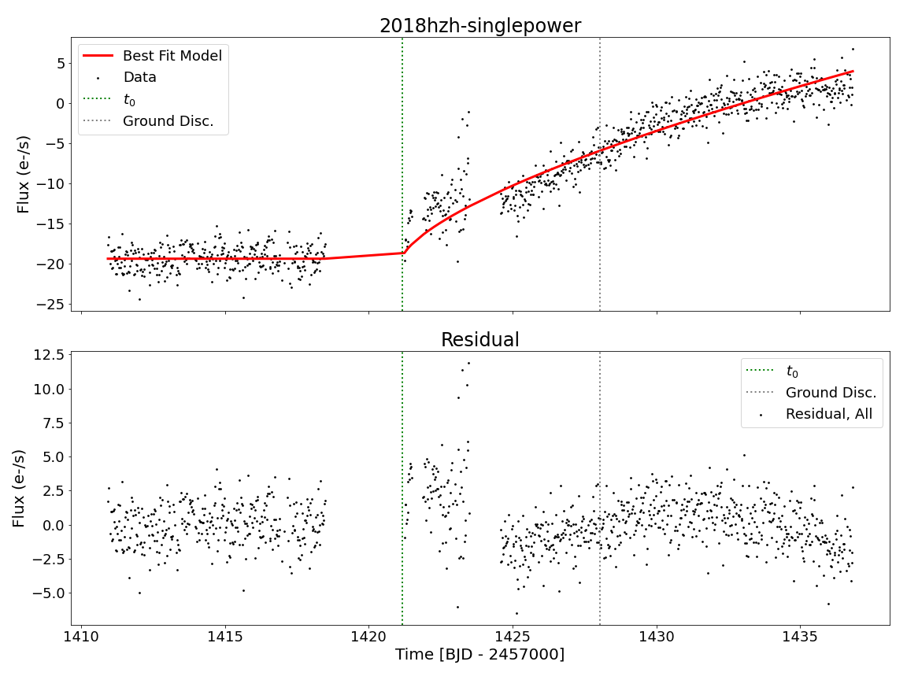

# etsfit
(Early Time Supernova FITting)

A wrapper package to do Bayesian modelling [(`emcee`)](https://emcee.readthedocs.io/en/stable/) including Gaussian Processes ( [`tinygp`](https://tinygp.readthedocs.io/en/stable/) ,[`celerite`](https://celerite.readthedocs.io/en/stable/)) noise modeling for early time supernovae serendipitiously observed by TESS. 
Supernova data was generally retrieved via [`tessreduce`](https://github.com/CheerfulUser/TESSreduce). 
#


## INSTALLING ME:
- git clone this repo
- cd into directory
-  ```pip install .```

## Tutorials + Paper Reproducer Code

Can be found in the `tutorials` directory above. 


## Quickest of quickstarts (from Tutorial 1): 

Imports:
``` 
import numpy as np
from etsfit import etsMAIN
import etsfit.utils.utilities as ut
import pandas as pd
from astropy.time import Time
```
Info load: 
```
TNSFile = "./tutorials/tutorial_data/2018hzh_TNS.csv"
TNSinfo = pd.read_csv(TNSFile)
dataFile = "./tutorials/tutorial_data/2018hzh0431-tessreduce"
save_dir = "."

(time, flux, error, targetlabel, 
                 sector, camera, ccd) = ut.tr_load_lc(dataFile)

discoverytime = ut.get_disctime(TNSFile, targetlabel)
```
Run it
```
ets = etsMAIN(save_dir, TNSFile)
                                      
ets.load_single_lc(time, flux, error, discoverytime, 
                   targetlabel, sector, camera, ccd)
   
#(optional) run a window RMS filter over the data 
filt = ets.window_rms_filt(plot=False)    
ets.pre_run_clean(1, flux_mask=filt, 
                    binning = False, fraction = None)
ets.run_MCMC(n1=10000, n2=50000)
```
# Example fit: 


# Citing etsfit

If you make use of etsfit, please cite (our paper when it comes out) and our major dependencies [emcee](https://arxiv.org/abs/1202.3665), [tinygp](https://zenodo.org/record/6473662), and [celerite](https://arxiv.org/abs/1703.09710). 